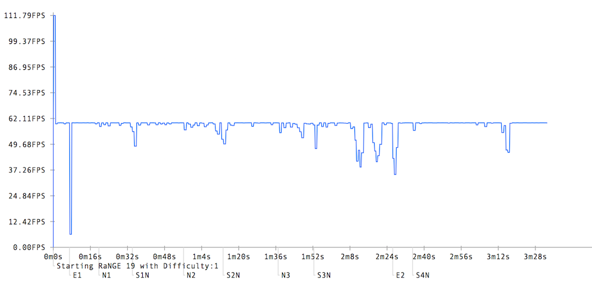
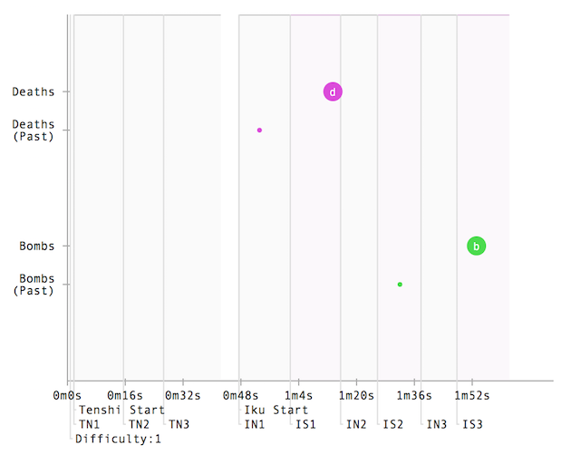

# Sparen's Danmakufu Application Monitoring System

Welcome to the repository for Sparen's Danmakufu Application Monitoring System! This system aims to track statistics over the lifetime of a script, outputting a report on request. 

This software is capable of profiling a single run of a script and monitoring behavior as well as aggregating data over multiple runs of a script, providing average case data as well as other visualizations. 

# Usage

### Setup - @Loading

To use the APM, you will first need to find a Stage Script (or Plural or Single) to monitor or profile.

In `@Loading` for the script of your choice, do the following:

```java
@Loading {
    let apm = LoadScript(GetCurrentScriptDirectory() ~ "./../SparenDNHAPM.dnh");
    //Set Common Data
    StartScript(apm);
}
```

Adjust the parameter of `LoadScript()` to the path to `SparenDNHAPM.dnh`. Once you've set all of the CommonData, run `StartScript()` to begin the APM script.

Example below:
```java
@Loading {
    let apm = LoadScript(GetCurrentScriptDirectory() ~ "./../../SparenDNHAPM.dnh");
    SetAreaCommonData("dnhapm", "OutputDirectory", GetCurrentScriptDirectory() ~ "./../dnhapm-output/");
    SetAreaCommonData("dnhapm", "ScriptName", "Moonstruck Magician");
    SetAreaCommonData("dnhapm", "GraphScale", 3);
    SetAreaCommonData("dnhapm", "GrazeUpdateFreq", 6);
    SetAreaCommonData("dnhapm", "UserNoteSlots", 3);
    StartScript(apm);
}
```

### Setup - Report Generation

At the end of your script (before it closes on regular termination/player death), you will need to notify the APM that it needs to generate its report. To do this, use NotifyEventAll. By default, the APM uses `EV_USER_STAGE + 2048` and will output to `GetCurrentScriptDirectory() ~ "./dnhapm-output/"`. 

**At least four frames of yielding are required between calling the event and closing the stage scene. This is because DNHAPM requires multiple frames to store data and generate the report. For futureproofing in case this value increases, it is recommended that you yield at least 6 frames before closing your stage scene.** If you are running DNHAPM via a Single script that closes itself via `CloseScript(GetOwnScriptID())`, it seems that the APM will continue running until completion, so no yield frames are needed, but it is recommended that you provide them anyways just as a precaution.

In addition, note that you can only write a report ONCE per run of a script. This is because when the event to generate the report is called, all logging tasks stop logging and write to file. These tasks are not restarted afterwards, meaning that if you were to call the event more than one time in a single script, later calls would overwrite the original report with the contents of the original report (i.e. no change), since no new data has been logged.

Example usage of the event call to trigger report generation below:
```java
task StageOver {
    while(!finished && GetPlayerState() != STATE_END){yield;}
    NotifyEventAll(EV_USER_STAGE + 2048, "");
    loop(60){yield;} // At least four frames are required between calling the event and closing the stage.
    ...
    CloseStgScene();
}
```

Modified CSV files as well as HTML files will be generated in the target directory. The CSV files, if kept, will allow for successive runs of the APM to log past data should aggregation be enabled. The HTML files contain the reports.

### Usage - Other Notes

This script works when saves as part of a replay, but replays made before the profiler was implemented will desync when run after the profiler has been added.

Typically, DNHAPM only needs to run in one script. If you wish to transition to a production or release environment after using the APM, all you need to do is block comment out the setup in `@Loading`, as the only other code needed to run DNHAPM will be Event calls in other scripts, which have minimal overhead.

For usage examples, refer to `test/*`.

# Customization

The APM uses CommonData in the "dnhapm" area for configuration. To set configuration, `SetAreaCommonData("dnhapm", "FieldToAdjust", New Value);` in `@Loading` between `LoadScript()`, which initializes the Common Data Area, and `StartScript()`, which runs the script with the specified parameters.

## Basic Configuration
```java
EVENT_DNHAPM_FINALIZE = GetAreaCommonData("dnhapm", "FinalizeEvent", EV_USER_STAGE + 2048);
OUTPUT_DIRECTORY = GetAreaCommonData("dnhapm", "OutputDirectory", GetCurrentScriptDirectory() ~ "./dnhapm-output/");
SCRIPT_NAME = GetAreaCommonData("dnhapm", "ScriptName", "--Unnamed Script--");
ENABLE_AGGREGATE = GetAreaCommonData("dnhapm", "EnableAggregate", true);
GRAPH_SCALE = GetAreaCommonData("dnhapm", "GraphScale", 2);
AGGREGATE_LINE_OPACITY = GetAreaCommonData("dnhapm", "AggregateLineOpacity", 0.25);
```

Basic configuration for the APM allows you to set the Event that is used to trigger writing the report (defaults to `EV_USER_STAGE + 2048`), the output directory of the report (defaults to `GetCurrentScriptDirectory() ~ "./dnhapm-output/"`), and the name of the script within the report (defaults to `"--Unnamed Script--"`).

Aggregate will load past data in the OUTPUT_DIRECTORY into the graphs (defaults to `true`). GRAPH_SCALE is the scale of the x axis of the graph (defaults to `2`, or two pixel per second). This means that a 5 minute script will fit into 300 pixels at a scale of 1, or 600 pixels at a scale of 2 (default).

In regards to aggregate data, this program assumes that the settings for prior runs were the same (i.e. it assumes that update frequencies, graph scale, etc. were the same as the current run). Former runs will appear with opacity equal to AGGREGATE_LINE_OPACITY (defaults to alpha of 0.25). It is recommended that you use a different output directory for each script to monitor. 

## Specific Configuration

By default, the APM will log everything specified, but there are Common Data to disable these features. Within each feature set, there are a number of different fields that can be adjusted.

This section will be populated with data as new features are implemented.

### FPS Monitoring
<p align="center">
    
    <br>
    <i>Sample FPS graph, showing lag spikes at plural loading and spellcard declaration</i>
</p>

```java
FEATURE_FPS_ENABLE = GetAreaCommonData("dnhapm", "FPSEnable", true);
FEATURE_FPS_UPDATEFREQ = GetAreaCommonData("dnhapm", "FPSUpdateFreq", 10);
FEATURE_FPS_LINECOLOR = GetAreaCommonData("dnhapm", "FPSLineColor", "#2266FF");
```

For FPS Monitoring, there are three fields - one for enabling the feature, one for the update frequency (defaults to every 10 frames), and one for the line color in the graphs (defaults to #2266FF).

For FPS Monitoring, note that Danmakufu internally updates FPS infrequently, so even with an update frequency of every 10 frames, you will get very straight lines.

### Graze Monitoring
```java
FEATURE_GRAZE_ENABLE = GetAreaCommonData("dnhapm", "GrazeEnable", true);
FEATURE_GRAZE_UPDATEFREQ = GetAreaCommonData("dnhapm", "GrazeUpdateFreq", 10);
FEATURE_GRAZE_LINECOLOR = GetAreaCommonData("dnhapm", "GrazeLineColor", "#887777");
```

For Graze Monitoring, similarly to FPS Monitoring, there are three fields - one for enabling the feature, one for the update frequency (defaults to every 10 frames), and one for the line color in the graphs (defaults to #887777).

For Graze Monitoring, note that the default update frequency will result in a less smooth chart, but should nevertheless provide a good approximation for longer scripts.

### Score Monitoring
```java
FEATURE_SCORE_ENABLE = GetAreaCommonData("dnhapm", "ScoreEnable", true);
FEATURE_SCORE_UPDATEFREQ = GetAreaCommonData("dnhapm", "ScoreUpdateFreq", 10);
FEATURE_SCORE_LINECOLOR = GetAreaCommonData("dnhapm", "ScoreLineColor", "#FF5555");
```

For Score Monitoring, similarly to FPS and Graze Monitoring, there are three fields - one for enabling the feature, one for the update frequency (defaults to every 10 frames), and one for the line color in the graphs (defaults to #FF5555).

For Score Monitoring, like Graze Monitoring, note that the default update frequency will result in a less smooth chart, but should nevertheless provide a good approximation for longer scripts.

In addition, note that score is often player dependent and this metric is therefore primarily applicable in games with a proper scoring system.

### Enemy Shot Count Monitoring
```java
FEATURE_SHOTCOUNT_ENABLE = GetAreaCommonData("dnhapm", "ShotCountEnable", true);
FEATURE_SHOTCOUNT_UPDATEFREQ = GetAreaCommonData("dnhapm", "ShotCountUpdateFreq", 10);
FEATURE_SHOTCOUNT_LINECOLOR = GetAreaCommonData("dnhapm", "ShotCountLineColor", "#FFCC55");
```

For Shot Count Monitoring, similarly to the other monitoring systems, there are three fields - one for enabling the feature, one for the update frequency (defaults to every 10 frames), and one for the line color in the graphs (defaults to #FFCC55).

For Shot Count Monitoring, like Graze and Score Monitoring, note that the default update frequency will result in a less smooth chart, but should nevertheless provide a good approximation for longer scripts.

### Death & Bomb Monitoring
```java
FEATURE_BOMBDEATH_ENABLE = GetAreaCommonData("dnhapm", "BombDeathEnable", true);
FEATURE_BOMBDEATH_BOMBCOLOR = GetAreaCommonData("dnhapm", "BombCircleColor", "#44DD44");
FEATURE_BOMBDEATH_DEATHCOLOR = GetAreaCommonData("dnhapm", "DeathCircleColor", "#DD44DD");
FEATURE_BOMBDEATH_MAINBULLETSIZE = GetAreaCommonData("dnhapm", "BDMainBulletSize", 8);
FEATURE_BOMBDEATH_SUBBULLETSIZE = GetAreaCommonData("dnhapm", "BDSubBulletSize", 2);
FEATURE_BOMBDEATH_TEXTSIZE = GetAreaCommonData("dnhapm", "BDBulletTextSize", 9);
```

For Death & Bomb Monitoring, similarly to the other monitoring systems, there is a field for enabling the feature. There is no field for update frequency since this monitoring system listens to `EV_PLAYER_SPELL` and `EV_PLAYER_SHOOTDOWN` rather than constantly logging data. There are two fields for the color in the graphs (defaults to #44DD44 for bombs and #DD44DD for deaths).

With Death & Bomb Monitoring, deaths and bombs appear as circles ('bullets') on the graph. Those in the current run have their radius default to 8, with 9px white font above them ('b' for bomb, 'd' for death). Aggregate data is rendered at a seperate location from the current run's data, and these circles have their radius default to 2. Since data from other runs is rendered at a seperate location, they do not currently render with opacity, though this may be changed if requested by end-users.

## Report Generating
The report generated by the APM by default provides the start time of data recording as well as the player. In addition, arbitrary text can be inserted into the first part of the report with USER_TEXT.

Use `SetAreaCommonData("dnhapm", "UserText", "");` to set the user text, which should be in proper HTML. You could technically override the existing CSS styles and inject JavaScript into the HTML body this way, but I advise against it.

### Notes
The system also allows for an arbitrary number of user notes. These user notes are per-run and only reflect the last run of the script.

```java
USER_NOTE_SLOTS = GetAreaCommonData("dnhapm", "UserNoteSlots", 2);
EVENT_USER_NOTE = GetAreaCommonData("dnhapm", "UserNoteEvent", EV_USER_STAGE + 2050);
ENABLE_NOTE_LINE = GetAreaCommonData("dnhapm", "EnableNoteLine", true);
```

There are 2 note slots by default, and notes render at the bottom of the graph. By default, `EV_USER_STAGE + 2050` is used to write notes to the monitoring system. 

For example:
```java
NotifyEventAll(EV_USER_STAGE + 2050, ["0", "Start"]);
```
This writes the "Start" note to note slot 0 (note slots are zero-indexed, and are passed as strings rather than integers).

Another example, for making note of when certain attacks start - in this case a spellcard:
```java
@Initialize {
    objBoss = ObjEnemy_Create(OBJ_ENEMY_BOSS);
    ObjEnemy_Regist(objBoss);
    CutIn(objBoss, "KORO", "Magic Sign \"The Glowing Waves of the Moon and Stars (N)\"", 5, BossCutIn, 0, 1, 384, 384);
    NotifyEventAll(EV_USER_STAGE + 2050, ["1", "S3N"]);
    ObjEnemyBossScene_StartSpell(objScene);
    ...
}
```

When using the note system, please be careful of text length. If your graph scale is small, if your notes are large, and/or if your notes are closely spaced together, text may overlap and become hard to read. It may therefore be helpful to abbreviate your notes (e.g. "Midboss Spell 2" - "MS2", etc.).

By default, all notes have a line dropped down from the x axis to their height for easy identification. The ENABLE_NOTE_LINE field adds another line up from the x axis to the top of the graph (in a lighter tone) for easier distinction where a note was placed. Depending on how you use the APM's notes, this may allow you to chunk the graph into 'phases' for easier analysis.

### Steps
<p align="center">
    
    <br>
    <i>Sample graph with default Step Logging settings, showing combined usage of Notes and Step Logging</i>
</p>

The APM also has the capability to log steps in Plural Scripts via `EV_START_BOSS_STEP`, `EV_END_BOSS_STEP`, and `EV_START_BOSS_SPELL`. Like with notes, these are per-run and only reflect the last run of the script. Together with notes, it becomes possible to see which attacks started at what time and how long they lasted. 

Step Logging comes with configuration settings like all of the other options.

```java
ENABLE_STEP = GetAreaCommonData("dnhapm", "EnableStep", true);
STEP_NONSPELLCOLOR = GetAreaCommonData("dnhapm", "StepNonspellColor", "#CACACA");
STEP_SPELLCOLOR = GetAreaCommonData("dnhapm", "StepSpellColor", "#DDBBDD");
ENABLE_STEP_LINE = GetAreaCommonData("dnhapm", "EnableStepLine", true);
```

First is the field for enabling and disabling the feature. After this come two color fields - one for the background color of nonspell blocks (defaults to #CACACA) and the other for spell blocks (defaults to #DDBBDD). Note that the blocks are rendered with opacity 0.1, so the colors will appear faint, but hopefully visibly enough that nonspell and spell steps can be distinguished from each other as well as portions outside of boss battles.

Finally, there is an option to enable/disable a line at the top of each step block. This line is in the specified color and can be used for clearer determination between different steps.

# Current and Planned Features

Current:
* FPS Monitoring  
* Graze Monitoring  
* Score Minitoring  
* Enemy Shot Count Minitoring  
* Death and Bomb Monitoring  
* User Notes  
* Step Monitoring (Nonspell and Spellcard Graph Overlays)  

Planned: 
* Item Monitoring (requires proper integrations)  
* Combined graphs (stretch goal)  

# Downloads

Official Releases are provided via GitHub releases.

# Contributing and Credits

Improvements and bug reports should be submitted via GitHub issues.

